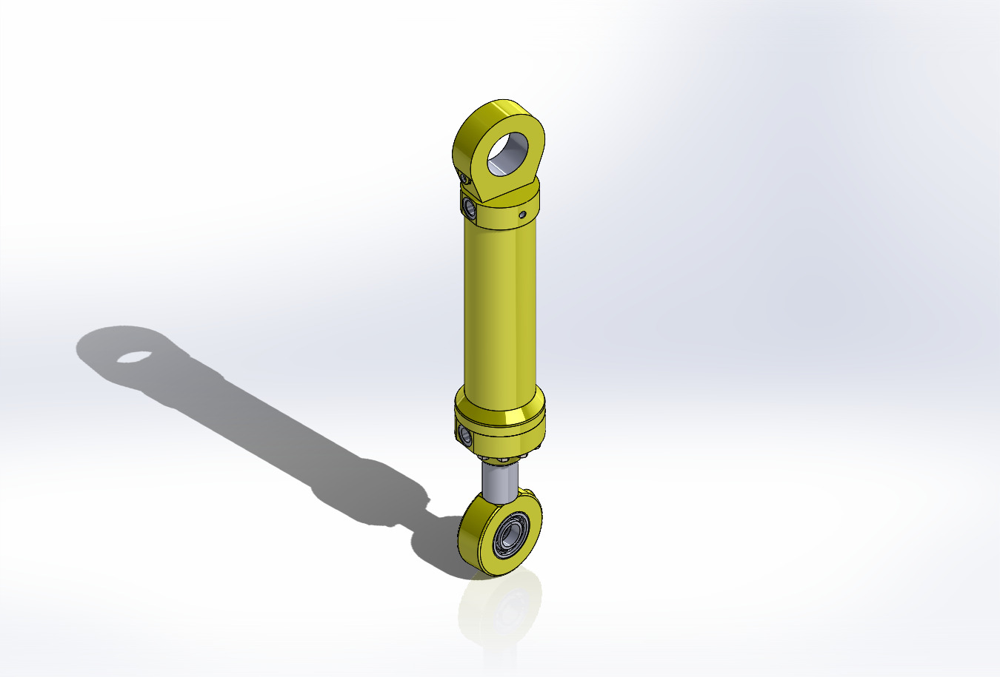
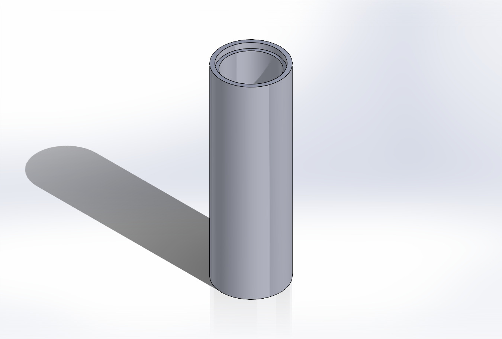
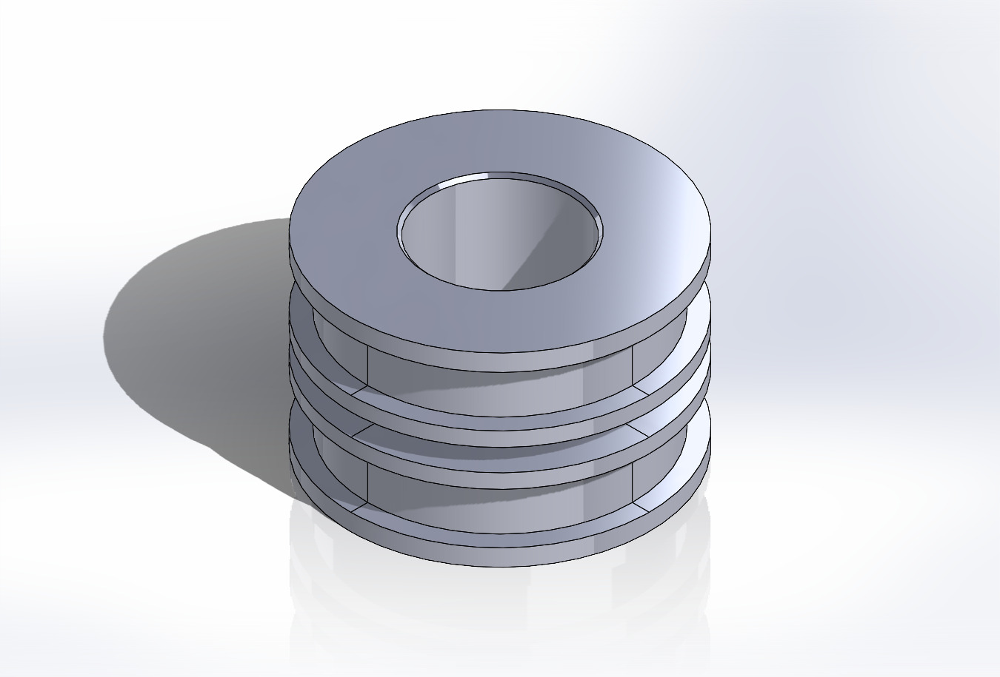

# Hydraulic-Cylinder
Solidworks design of an hydraulic cylinder
## Render:

## Full Body Assembly
---

## Parts:
---
### Ball Bearing

### Barrel Cap

### Barrel

### End Cap

### Front Cap

### Front Clevis

### Piston Cap

### Piston Rod

### Piston 

### Rear Clevis
